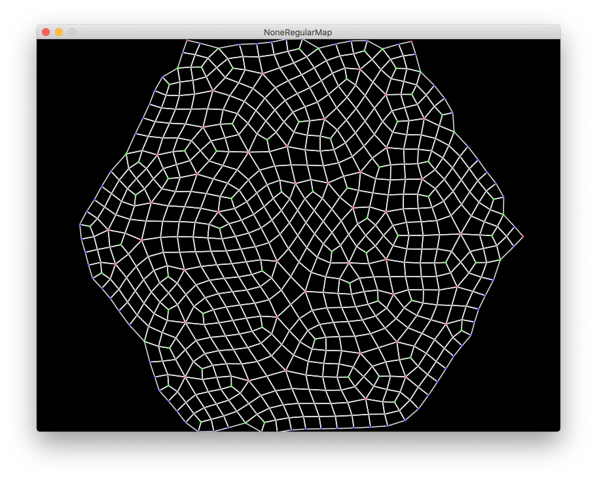

# NoneRegular Map Generator

Following this algorithm [form the developper of TownScraper](https://www.youtube.com/watch?v=1hqt8JkYRdI&feature=youtu.be)

## Inside 

**First step**: Build hexagonal tiling using [this](https://www.redblobgames.com/grids/hexagons/)
In short  : 

1. just shearing a rectangulal grid will give us what we need. 

2. Merge closest vertices into edges 

3. Merge triplet of edges in triangle

**Second Step** Randomly megre two adjacent triangles into one quad


The random algorithm is quite simple : take a lint of int corresponding to the id of each link. 
Randomly pick two elements of the list and swap them. Repeat this as many time as you want. 
Start at the top of the list and merge triangle in the ordre specify by your shuffled list.
This process is a bit clumssy and lead to triangle that cannot be merged.
The border has hole and you find some alone triangle inside the quads. Which is not what we wanted

We will get on our feed with the next step. We will sub-divide quad into 4 but we can sub dived triangle into 3 quad. 
The quand are ment to be perfect or pretty, this will be done with the last step

**example** 

```
|\
| \
|  \
|\  \
| \ _\
|  |  \
|__|___\

```

With no random we have all the triangle merged which is nice. We will deal with the randomness later

**Third Step** Sub dividing quad into 4 smaller quad and triangle into 3 quad


**Fourth Step** Relaxing quad to have more smooth grid

We will use the [Smoothing Algorithm for Planar and Surface Mesh Based on Element Geometric Deformation by 
Shuli Sun, Minglei Zhang, and Zhihong Gou](http://downloads.hindawi.com/journals/mpe/2015/435648.pdf). Thanks to them. I have made a stand alone implementation [here](https://github.com/Canadadry/smoothing-mesh)

And voilà 



## Demo Usage

### Setup
- `npm install`
- Have LOVE installed in path

### Running
- `npm run start`

### Packing for sending 
- `npm run pack`
